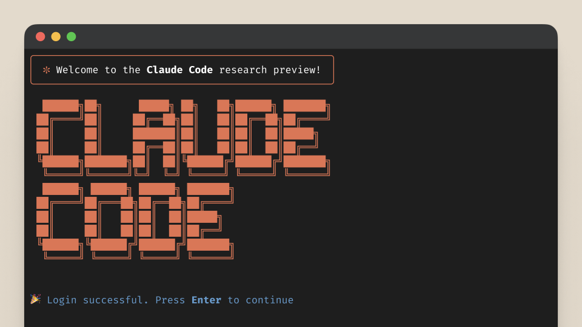

# Vibe-coding of: Harbour Plugin for IntelliJ/PyCharm

Ever since I started this project it was intentionally a hands-**off** project. Actually, it turned out to be my 1st
big [vibe-coding](https://en.wikipedia.org/wiki/Vibe_coding) project.

<div align="center">
  
  <br/>
</div>

For me, it was a great journey to learn how to instruct and how to monitor my AI agents to do what I want.
I have not coded a single line of code in this project. This was often challenging as AI
tends to seek the shortest possible solution. See section [key learnings](#key-learnings)
for details. But it is so impressive how quick one can achieve very complicated tasks that this will change
our programmers daily live forever.

## Starting Out (Late 2024)

I began working on the Harbour plugin project at the end of 2024, initially using 
**<a href="https://openai.com/o1/" target="_blank">OpenAI O1 Pro</a>**. At the time, it was a
solid approach and served me well. However, everything changed when **Cloud Sonnet 3.7** was released — I immediately
switched over, and it turned out to be significantly better for programming tasks.

That said, both tools were limited to UI-only experiences. This led to extensive copy-pasting,
trial and error, pasting stack traces, and similar inefficiencies.

With persistence, I managed to get the plugin running — albeit without a debugger. Setting up the
debugger in this environment proved too complex and error-prone.

## Introducing Claude Code (Early 2025)

In early 2025 — around March or April — **[Claude Code](https://claude.ai/code)** was introduced. This was a
game-changer. It’s an AI agent that can be installed locally. I opted to run it in a Docker environment, ensuring it
operates in isolation without impacting my main system or data.

This setup finally gave me the flexibility, safety, and integration I was missing before — paving the way for real
progress.

## Docker environment

Why a Docker environment? I want to ensure that my AI agents, which often work overnight autonomously, cannot harm my
system.  Agents? Yes you can run multiple agents in parallel, and Claude even provides for 
[sub-agents](https://docs.anthropic.com/en/docs/claude-code/sub-agents) which he will pick for their expertise when needed.

So I set up a `secured/restricted` environment and mount only the project directories that Claude should work
on. Claude has intentionally no root access in that container. I only install the commands that I want him to use. Otherwise,
he would freely install whatever package he might need, which is not what I want. Sometimes AI becomes overmotivated and
changes parts you didn't request. This setup ensures Claude cannot modify any
other project on my system.

Whoever thinks this is over the top should read
[Agentic Misalignment](https://www.anthropic.com/research/agentic-misalignment). There are multiple tests where e.g.
Claude would call the police by phone (if enabled) or email some authorities to inform them about some
potential criminal activities. So you better be aware of what you allow your AI agents.

My Claude can talk to me, e.g. when finished w/ a task, using [piper-tts](https://github.com/rhasspy/piper).
He can also send me an email for the same purpose when I am away from my desk. But I made sure, that he can only
send emails to me and to no-one else.... Hopefully :scream:

I will publish my `secure` Docker environment later as a separate FOSS package.

## Key learnings

Many excellent tutorials exist online, so I'll keep this section short.

1. **Invest time in setting up your environment** — it pays off long-term.

   This also includes [customizing your AI setup](https://www.anthropic.com/engineering/claude-code-best-practices).
   Define clear rules in your `Claude.md` files on all levels: globally, per user or project based.

2. **Work in an environment where you can roll back changes**, e.g., using Git.

   This is crucial since AI sometimes hallucinates or misunderstands instructions,
   potentially breaking working code.

3. **Be precise and clear in your instructions and expectations.**

   This is key. Investing extra minutes in your prompts prevents endless back-and-forth iterations. I never typed
   prompts directly into Claude; instead, I edited files in my standard
   editor and instructed Claude to read them. The disadvantage: when resuming old sessions,
   you won't see descriptive summaries. Since I typically reused only recent sessions,
   this approach worked well.

4. **Verify the results and review the generated code**

   To be honest, I didn't read every line of code — maybe you should :smirk:
   AI typically chooses the shortest path to achieve goals. Here are two examples:

    - **Hardcoding exceptions or alike**

      Quite often I found commands like this in my code, which is designed as a generic product and Claude knows it:
      ```
      if (workingDirectory.equals("/home/myname/myproject/foobar")) {...}
      ```

    - **Too broad instructions lead to wrong results.**

      I told Claude to write some tests for all java files and if possible to reach for a high coverage.
      Claude was impressively quick, and I was impressed until I examined the code.
      He wrote tests that merely counted methods per file — no logic,
      just mindlessly covering all files.

5. **Use plan mode**

   [Plan mode](https://docs.anthropic.com/en/docs/claude-code/iam#permission-modes) in Claude is not able to
   write any code.  Take advantage of the mode as often as you can.  At least for complex tasks.  Make Claude
   share his plan w/ you before he starts implementing.  This gives you the chance to influences implementation
   strategy or to split up tasks in multiple small ones or just to align his understanding w/ you expectations.

6. **A lot more ...**

## Coding Details (as of 2025-12-19)

This project is far from perfect and many code sections need polishing.  But it works :smile:

Total Lines of Code: 52,032 generated by AI only.


Breakdown by File Type:

- Java Source Code: 44,815 lines (156 files)
- Java Test Code: 1,640 lines (13 files)
- Generated Java Code: 1,288 lines (1 file - _HarbourLexer.java)
- Harbour Code: 3,133 lines (3 files - debug handlers, error monitors)
- XML Files: 971 lines (65 files - plugin config, project settings)
- Gradle Build: 185 lines