# Harbour Language Plugin for PyCharm

A comprehensive plugin for <a href="https://www.jetbrains.com/pycharm/" target="_blank">PyCharm</a> that provides
advanced support for the <a href="https://harbour.github.io/" target="_blank">Harbour/Clipper</a> programming language.

This plugin was implemented as `vibe-coding` project using <a href="https://openai.com/o1/" target="_blank">OpenAI
O1</a>
and <a href="https://claude.ai/" target="_blank">Claude</a>. For detailed development insights and experiences, see
the [MAKING-OF](./MAKING_OF.md).

## Table of Contents

- [Installation](#installation)
- [Features](#features)
- [Settings](#settings)
- [Roadmap](#roadmap--todos)
- [Known Issues](#known-issues)
- [VS Code Users](#vs-code-users)
- [Building Plugin](#building-plugin)
- [Development](#development)
- [License](#license)

## Installation

1. Download the latest plugin from the <a href="https://github.com/jo47011/intellij-harbour/releases/" target="_blank">
   releases page</a>
2. In PyCharm: **Settings** → **Plugins** → ⚙️ → **Install Plugin from Disk...**
3. Select the downloaded plugin file and restart PyCharm

### Important: File Size Limits Configuration

By default, PyCharm/IntelliJ has file size limits that may be too small for large Harbour projects. To work with files larger than 2.5 MB, you need to manually configure these limits:

1. Go to **Help** → **Edit Custom Properties**
2. Add the following lines to the file:
   ```
   idea.max.intellisense.filesize=102400
   idea.max.content.load.filesize=204800
   ```
   These values set the limits to 100 MB for code assistance and 200 MB for file opening.
3. Save the file and restart the IDE

**Note:** These are IDE-level settings that must be configured manually and cannot be changed by plugins at runtime.

## Features

- **[Syntax Highlighting](#syntax-highlighting)** - Complete color coding for Harbour/Clipper keywords, functions, and
  syntax
- **[Code Completion](#code-completion)** - Intelligent auto-completion for functions, methods, and variables
- **[Function Navigation](#function-navigation)** - Go-to-declaration and reference resolution
- **[Rename Refactoring](#rename-refactoring)** - Safe renaming of functions and variables across projects
- **[Structure View](#structure-view)** - Tree view of functions, procedures, and classes
- **[Code Formatting](#code-formatting)** - Automatic code indentation and formatting
- **[Linting](#linting)** - Real-time code analysis and error detection
- **[Debugging](#debugging)** - Full breakpoint debugging for console and GUI applications with database inspection
- **[Automatic Error Monitoring](#automatic-error-monitoring)** - Clickable stack traces for runtime errors
- **[Code Helpers](#code-helpers)** - Quick actions to improve code quality and reduce typing

### Syntax Highlighting

Full color coding support for Harbour/Clipper syntax with customizable color schemes. Keywords, functions, comments,
strings, and operators are distinctly highlighted for better code readability.

<p align="center">
  
  <br>
  <em>Enhanced syntax highlighting with customizable color schemes</em>
</p>

### Code Completion

Intelligent auto-completion suggests functions, methods, variables, and Harbour commands as you type. Supports both
built-in Harbour functions and user-defined functions from your project.

<p align="center">
  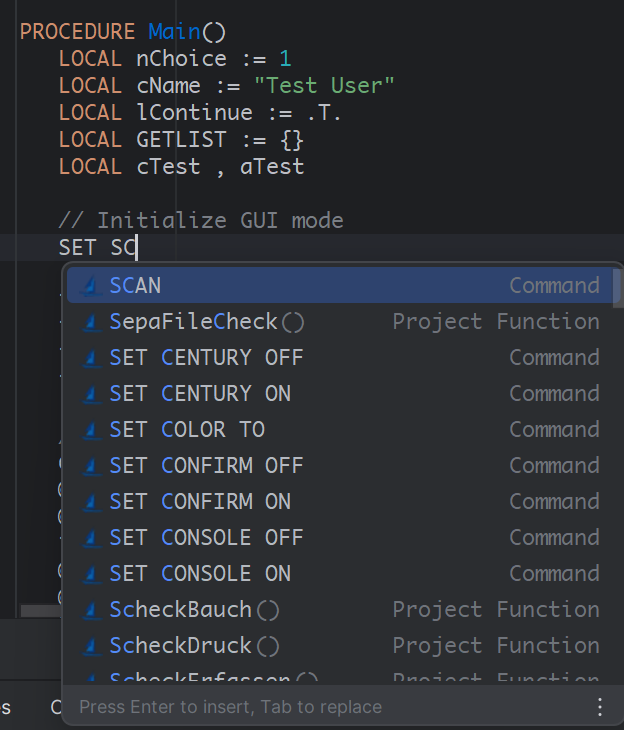
  <br>
  <em>Smart auto-completion for Harbour functions and variables</em>
</p>

### Function Navigation

Quickly navigate to function definitions with **Ctrl+Click** or **Ctrl+B**.
The plugin resolves references across files for custom defined and built-in functions, variables, etc.
For external harbour functions an external documentation link (configurable in the settings) will be opend.

<p align="center">
  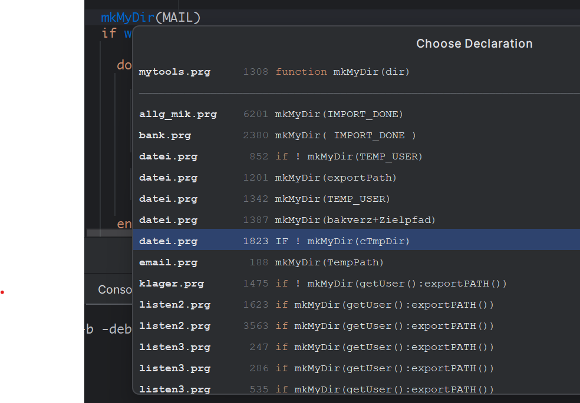
  <br>
  <em>Function navigation with external documentation links for built-in functions</em>
</p>

Same applies for procedures, classes, methods and variables. Newly added function, procedures, etc. are added to the
index once the file is saved.

### Rename Refactoring

Safely rename functions, procedures, and variables across your entire project with **Shift+F6**. All references are
automatically updated while preserving code functionality.

<p align="center">
  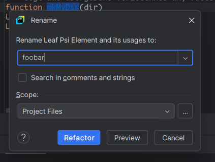
  <br>
  <em>Safe project-wide rename refactoring for functions and variables</em>
</p>

### Structure View

The structure view panel (**Alt+7**) shows a tree overview of functions, procedures, classes, and variables in the
current file for easy navigation.

<p align="center">
  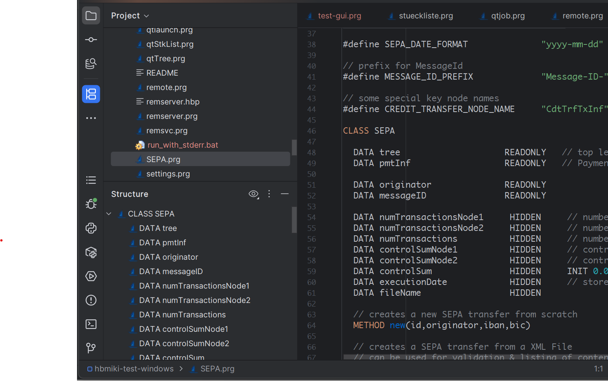
  <br>
  <em>Structure view showing project organization</em>
</p>

### Code Formatting

Automatic code indentation and formatting follows Harbour conventions. Customize indentation, line breaks, and statement
positioning in settings.

#### Command-Line Formatting

The Harbour plugin enables command-line formatting through PyCharm/IntelliJ's built-in CLI tools. This feature works automatically once the plugin is installed - no additional setup required.

**How it works:**
- PyCharm/IntelliJ IDEA provide the `format` command as part of their standard CLI tools
- Our plugin registers the Harbour formatter with the IDE's formatting system
- When you run the format command on `.prg` or `.ch` files, the IDE uses our plugin's formatter
- The IDE runs in headless mode (no GUI) to perform the formatting

#### PyCharm
```bash
# Format a single file
pycharm.sh format /path/to/file.prg

# Format all files in a directory recursively
pycharm.sh format -recursive /path/to/project

# Format with custom settings
pycharm.sh format -s /path/to/settings.xml /path/to/project
```

#### IntelliJ IDEA
```bash
# Format a single file
idea.sh format /path/to/file.prg

# Format all files in a directory recursively
idea.sh format -recursive /path/to/project
```

**Requirements:**
- The Harbour plugin must be installed in the IDE
- The IDE must not be running when using command-line formatting
- The `pycharm.sh` or `idea.sh` script must be in your PATH or use full path to the script

**Testing the formatter:**
You can use these commands to test formatting during development without opening the IDE.

### Format Exclusion

You can exclude specific sections of code from automatic formatting using special comments:

- **Block exclusion**: Use `// fmt: off` and `// fmt: on` (or `# fmt: off` and `# fmt: on`) to exclude a block of code:
  ```harbour
  // fmt: off
  ? "This line will not be formatted"
  ? "Neither will this one"
  // fmt: on
  ? "This line will be formatted normally"
  ```

- **Single line exclusion**: Use `// fmt: skip` (or `# fmt: skip`) to skip formatting for a single line:
  ```harbour
  ? "This will be formatted"
  ? "This won't be formatted"  // fmt: skip
  ? "This will be formatted"
  ```

<p align="center">
  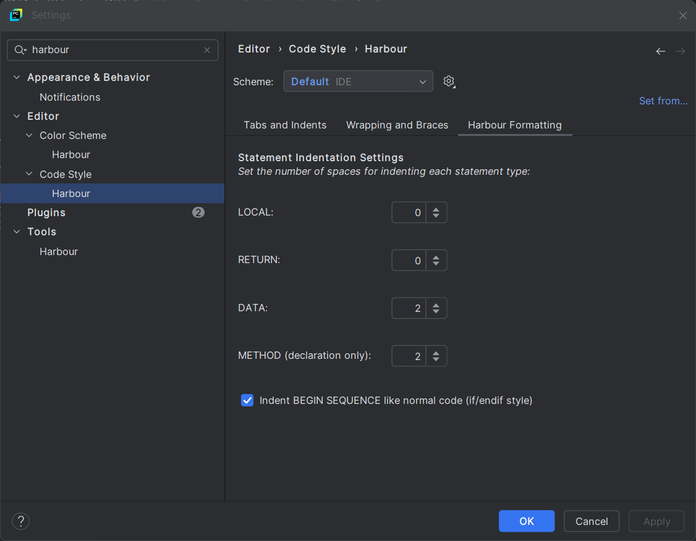
  <br>
  <em>Customizable code formatting options</em>
</p>

### Linting

Real-time code analysis provides instant feedback on syntax errors, undefined variables, and potential issues as you
type. The linting engine integrates seamlessly with PyCharm's inspection framework.

<p align="center">
  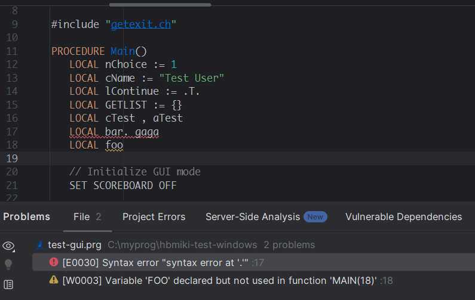
  <br>
  <em>Real-time linting highlights syntax errors and undefined variables</em>
</p>

Configure linting settings in **Settings** → **Tools** → **Harbour** → **Linting**:

<p align="center">
  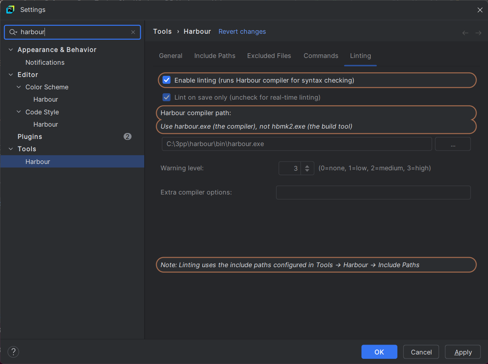
  <br>
  <em>Customizable linting rules and severity levels</em>
</p>

> **Note:** For proper linting functionality, ensure all include paths are correctly configured in your project settings. Missing include files or incorrect paths may prevent the linter from detecting syntax errors and unused variables.

## Debugging

The plugin provides **full debugging support** for both console and GUI applications with PyCharm debugger integration
featuring conditional breakpoints, variable inspection, step debugging, and watches.

### Variable Types Supported

- **Local Variables**: Function/procedure local variables (`LOCAL nVar`)
- **Private Variables**: Private memory variables (`PRIVATE m_nVar`)
- **Public Variables**: Public memory variables (`PUBLIC g_nVar`)
- **Static Variables**: Currently not supported due to Harbour VM limitations

### Setup

1. **Create Debug Configuration** - Use `Harbour Application` type in PyCharm run configurations
   <p align="center">
     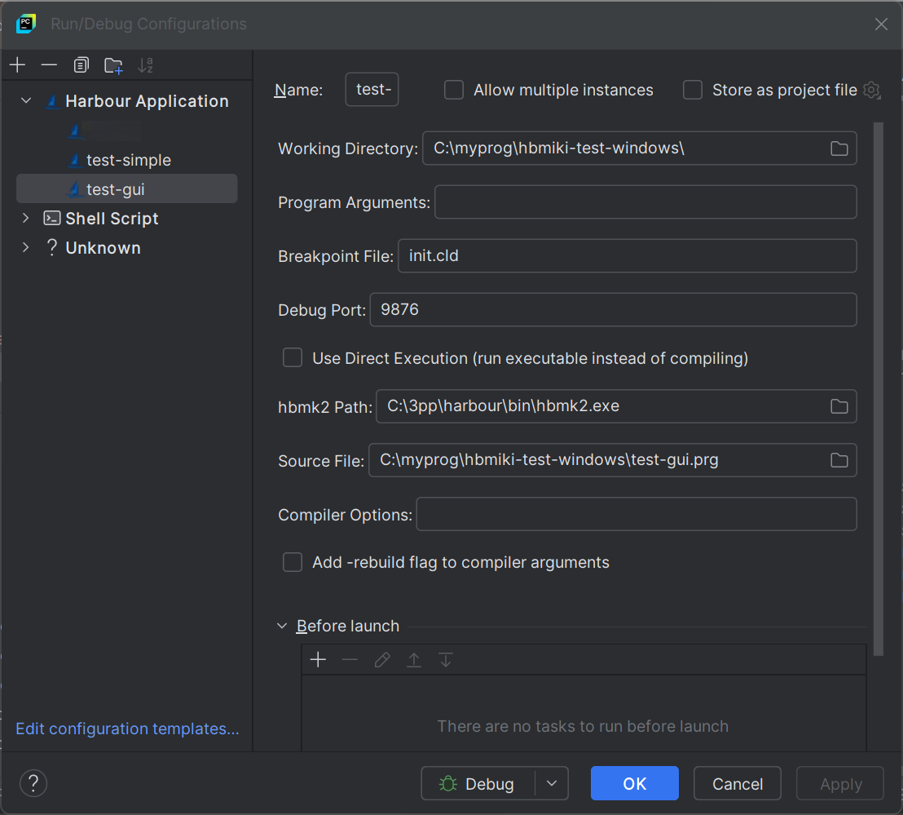
     <br>
     <em>Harbour Application debug configuration settings</em>
   </p>

   *Note: Debug flags (`-b -D__HARBOUR_DEBUG__`) are automatically added when using PyCharm debug configurations.*

2.**Set Breakpoints** - Click in the gutter next to line numbers
<p align="center">
  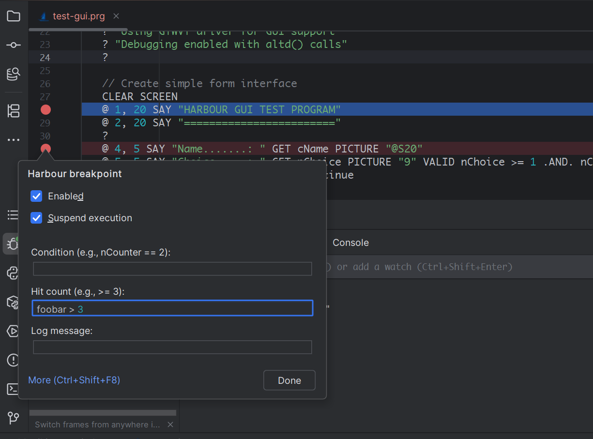
  <br>
  <em>Console debugging with breakpoints and variable inspection</em>
</p>

3. **Start Debugging** - Use Debug button or **Shift+F9**

<p align="center">
  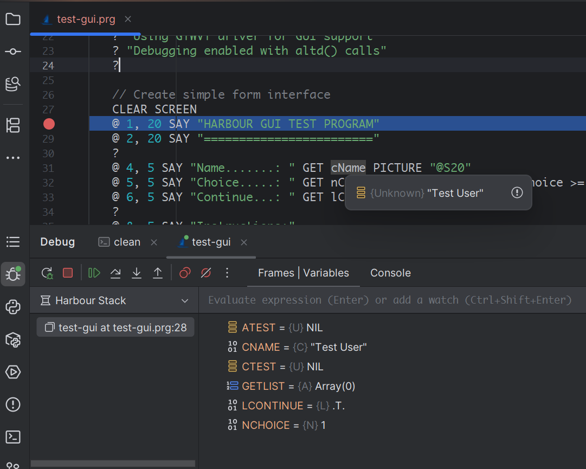
  <br>
  <em>GUI debugging with PyCharm debugger and variable inspection</em>
</p>

### Database View

During debugging, the plugin provides a Database View tool window that shows all currently open database workareas in your Harbour application. This allows you to inspect database state while stepping through code.

<p align="center">
  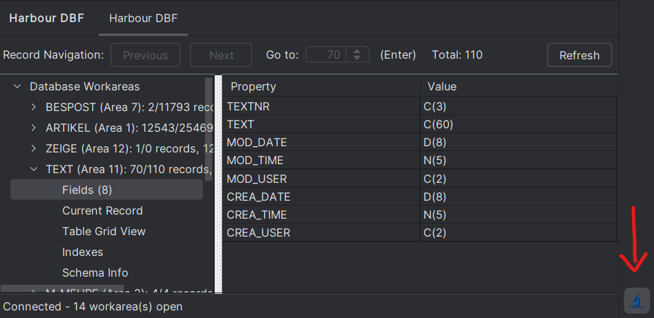
  <br>
  <em>Database workarea browser showing open databases during debugging</em>
</p>

**Features:**
- View all open database workareas (Area 1, Area 2, etc.)
- Inspect current record data and field values
- See field structure (name, type, size)
- Navigate between records using Previous/Next buttons
- Jump to specific record numbers
- View indexes and schema information
- Refresh data to see updates

The Database View automatically updates when you step through code that opens, closes, or modifies database records.

**Performance Note:** The Database View queries the debugger for workarea information on each update. 
For optimal debugging performance, keep the DB View panel collapsed when not actively inspecting database state.

### Pause/Break Without Breakpoints

The debugger supports pausing execution at the current point without setting breakpoints:

**Method 1: Using Alt-D in PyCharm**
- Press **Alt-D** in PyCharm while your Harbour program is running
- The debugger will pause at the next line of code execution
- **Important**: Alt-D must be pressed in PyCharm (not in the Harbour application window)
- Works even when the application is waiting for user input (GET/READ operations)

**Method 2: Calling AltD() in Your Code**
- Add `AltD()` function calls in your Harbour code where you want to break
- The debugger will stop at that line when executed
- Useful for conditional breaks: `IF nError > 0; AltD(); ENDIF`

**Limitations:**
- Pressing Alt-D in the Harbour application window (not PyCharm) will not trigger a pause
- During GET/READ operations, the pause occurs at the last executed line before waiting for input

### Limitations

- **Static Variables**: Static variables are not visible in the debugger due to Harbour VM
  compilation-unit scoping

### Automatic Error Monitoring

The plugin automatically provides clickable stack traces for runtime errors in the PyCharm console.

<p align="center">
  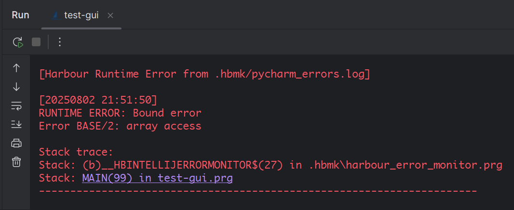
  <br>
  <em>Clickable stack traces for quick navigation to error locations</em>
</p>

### Custom ErrorBlock Integration

If your project uses a custom ErrorBlock handler, you can still get clickable stack traces by
calling `printDebugStackTrace()` from your error handler:

```harbour
// Your custom error handling
ErrorBlock({|oError| MyCustomHandler(oError)})

FUNCTION MyCustomHandler(oError)
   // Your custom error logic here

   // Generate PyCharm-compatible stack trace when running in PyCharm
   #ifdef DBG_PORT
      printDebugStackTrace()
   #endif

   // Continue with your error handling
RETURN NIL
```

**Key points:**

- Add `printDebugStackTrace()` to your custom error handler
- Use `#ifdef DBG_PORT` to conditionally include it (works for both debug and run modes in PyCharm)
- This generates clickable stack traces in PyCharm console
- Works alongside your existing error handling logic
- The code compiles cleanly outside PyCharm (the function call is skipped)

## Code Helpers

The plugin provides quick actions to improve code quality and reduce repetitive typing:

### Declare Local Variable (Alt+L)

Quickly declare undefined variables as LOCAL with proper placement and indentation.

**How to use:**
1. Place cursor on any undefined variable in your code
2. Press **Alt+L** 
3. The plugin automatically:
   - Detects the variable name under cursor
   - Finds the containing function or procedure
   - Adds `LOCAL variableName` declaration at the proper position
   - Respects your LOCAL indentation settings

**Example:**
```harbour
FUNCTION TestFunction()
   LOCAL existingVar
   
   myNewVar := 10  // Place cursor on 'myNewVar' and press Alt+L
   // Plugin will add: LOCAL myNewVar
```

**Features:**
- Smart placement after existing LOCAL declarations
- Validates variable names (prevents declaring keywords)
- Checks for duplicate declarations
- Uses indentation from code style settings
- Shows helpful notifications for errors or success

## Settings

Access Harbour plugin settings: **Settings** → **Tools** → **Harbour**

<p align="center">
  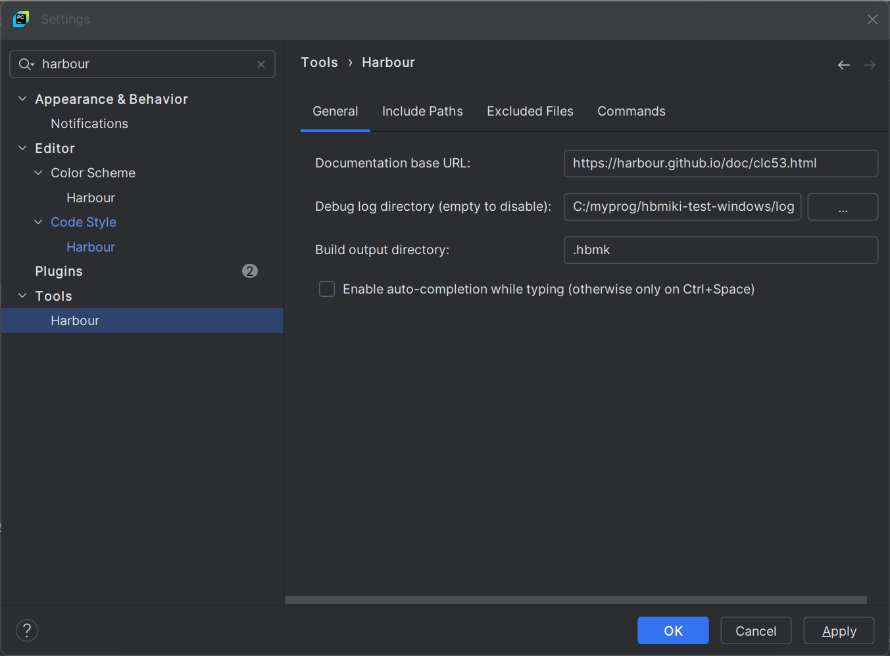
  <br>
  <em>Configure Harbour tools, paths, and debugging options</em>
</p>

### Configuration Options

- **Documentation URL** - Base URL for external Harbour documentation
- **Debug Log Directory** - Location for debug logs (empty to disable)
- **Build Output Directory** - Default `.hbmk` for build artifacts
- **Auto-completion** - Enable while typing (default: Ctrl+Space only)
- **Include Paths** - Add directories for #include file resolution
- **Excluded Files** - Files and directory patterns to exclude from navigation and indexing
- **Commands** - Customize code completion command list

### Directory Exclusions

To improve indexing performance, you can exclude directories from the plugin's indexing:

**Settings** → **Tools** → **Harbour** → **Excluded Files** tab

- **Directory patterns**: Add patterns like `backup`, `temp`, `Copy`, `.hbmk` to exclude matching directories
- Use the **Browse** button to select a directory - its name is added as a pattern
- Default: `.hbmk` (build output directory) is excluded
- Patterns match case-insensitively against directory names in paths

**Note:** This affects the Harbour plugin's indexing only. 
For complete exclusion from IntelliJ's native indexing, also mark directories as **Excluded** in Project Structure (**F4**).

### Code Style Settings

Customize code formatting: **Settings** → **Editor** → **Code Style** → **Harbour**

<p align="center">
  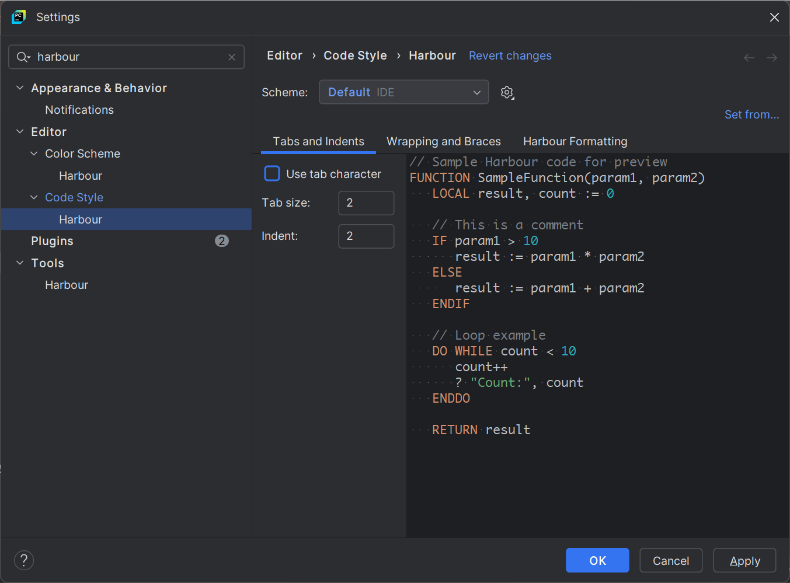
  <br>
  <em>Configure indentation, spacing, and formatting rules</em>
</p>

### Color Scheme Settings

Customize syntax highlighting: **Settings** → **Editor** → **Color Scheme** → **Harbour**

<p align="center">
  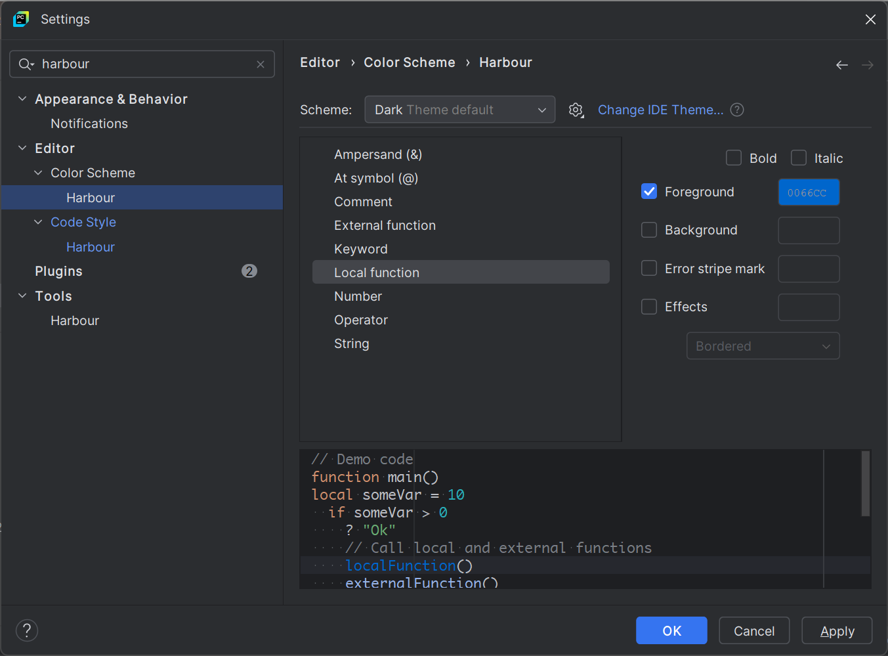
  <br>
  <em>Customize syntax highlighting colors and themes</em>
</p>

## Roadmap / TODOs

- **Official JetBrains Plugin** - Submit to JetBrains Marketplace for easier installation
- **Process Coupling** - When the debugging process in PyCharm is stopped the running harbour GUI should be terminated
  as well.
- **Tests** - write tests.

## Known Issues

- **Ctrl+hover** should not show tooltip
- **Ctrl-click**: Internal function navigation may jump to function definition instead of showing a declaration dialog
  if the file w/ the function definition misses some include file or if the list of usages is very long.
  Subsequent click on function declaration itself work.
- most function/procedure features do not work yet for truncated keywords func/proce.

## VS Code Users

For Visual Studio Code users, there's an
excellent <a href="https://github.com/APerricone/harbourCodeExtension" target="_blank">Harbour Code Extension</a>
available. This VS Code plugin was a great help and inspiration during the development of our PyCharm plugin, providing
valuable insights into Harbour language support implementation.

## Building Plugin

### Prerequisites

1. **Java Development Kit 11+** - <a href="https://www.oracle.com/java/technologies/downloads/" target="_blank">Download
   from Oracle</a> or <a href="https://openjdk.org/" target="_blank">OpenJDK</a>
2. **IntelliJ Platform Plugin SDK** - Automatically downloaded by <a href="https://gradle.org/" target="_blank">
   Gradle</a>

### Build Steps

1. **Clone the repository:**
   ```bash
   git clone https://github.com/jo47011/intellij-harbour.git
   cd intellij-harbour
   ```

2. **Verify Java version:**
   ```bash
   java -version  # Should show Java 11 or higher
   ```

3. **Build the plugin:**
   ```bash
   ./gradlew buildPlugin  # Linux/macOS
   gradlew.bat buildPlugin  # Windows
   ```

   *Note: The `gradlew` (Gradle Wrapper) script is included in the repository and automatically downloads the correct
   Gradle version.*

4. **Find the built plugin:**
   ```
   build/distributions/harbour-language-plugin-x.x.x.zip
   ```

### Development Setup

For plugin development, you can also run a development instance:

```bash
./gradlew runIde
```

This launches PyCharm with the plugin pre-installed for testing.

### Environment Variables

For tests and command-line formatting that require the Harbour compiler, set `HARBOUR_HOME`:

```bash
# Linux/macOS
export HARBOUR_HOME=/path/to/harbour

# Windows
set HARBOUR_HOME=C:\harbour
```

The plugin expects the following structure:
- `$HARBOUR_HOME/bin/linux/gcc/harbour` (Linux)
- `$HARBOUR_HOME/bin/harbour.exe` (Windows)
- `$HARBOUR_HOME/include/` (header files)

## Development

### Test Files

Located in: `src/test/java/org/intellij/sdk/language/`

| Test File | Purpose |
|-----------|---------|
| `HarbourFormattingTest.java` | Format all PRG files in a directory and verify they compile |
| `SingleFileTest.java` | Individual file tests for specific formatting bugs |
| `StringContinuationTest.java` | Tests for string continuation handling |

### Running Tests

**HarbourFormattingTest** (main formatter test - formats PRG files and verifies compilation):

```bash
# Format all PRG files in a directory
./gradlew test --tests "*HarbourFormattingTest*" -DtestDir=/path/to/prg/files

# With optional parameters
./gradlew test --tests "*HarbourFormattingTest*" \
  -DtestDir=/path/to/prg/files \
  -DharbourCompiler=/path/to/harbour \
  -DharbourInclude=/path/to/include \
  -DlineBreakPosition=99
```

**Other tests:**

```bash
# Run all SingleFileTest tests
./gradlew test --tests "*SingleFileTest*"

# Run StringContinuationTest
./gradlew test --tests "*StringContinuationTest*"

# Run all tests (HarbourFormattingTest is skipped without -DtestDir)
./gradlew test
```

## License

This project is licensed under the [MIT License](./LICENSE).