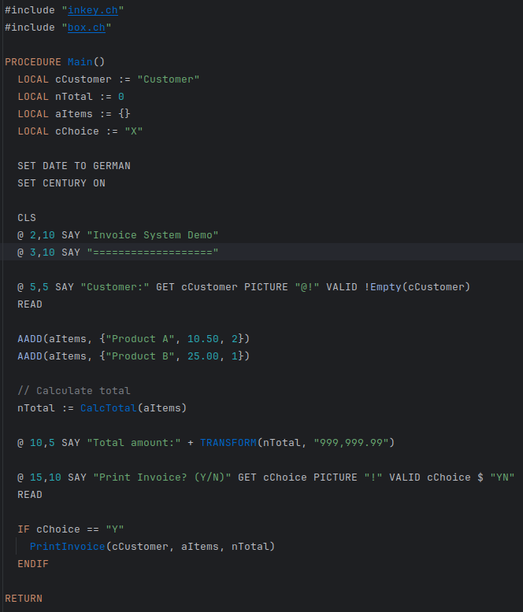

# Harbour Language IntelliJ Plugin

# Harbour Language Plugin for IntelliJ

A plugin for IntelliJ IDEA that provides support for the Harbour/Clipper programming language.

## Features

- Syntax highlighting
- Code completion
- Function and procedure navigation
- Reference resolution
- Rename refactoring
- Structure view
- Code formatting
- [Debugging](#debugging-features)
- Enhanced navigation popup with syntax highlighting

## Introduction

This package was purely implemented by O1 pro and Claude 3.7.  No code was written by myself.  I just did the
orchestration and provided some help here and there.  If you are interested in my experiences see the making-of.

## Debugging Features

The plugin provides **dual debugging support**, automatically choosing the appropriate method:

- **Console Applications**: Full PyCharm debugger integration with conditional breakpoints, variable inspection, step debugging, and watches
- **GUI Applications**: Uses Harbour's internal debugger with breakpoints written to `init.cld`
- **Automatic Detection**: Detects GUI flags (`-gui`, `-gtwvt`) in .hbp files to choose debugging method

### Variable Types Supported

- **Local Variables**: Function/procedure local variables (`LOCAL nVar`)
- **Private Variables**: Private memory variables (`PRIVATE m_nVar`)
- **Public Variables**: Public memory variables (`PUBLIC g_nVar`)
- **Static Variables**: Currently not supported due to Harbour VM limitations

### Setting Up Debugging

1. **Compile with Debug Info**: Ensure your Harbour program is compiled with debug information:
   ```bash
   hbmk2 yourprogram.prg -b -D__HARBOUR_DEBUG__
   ```
   Note: The `-b` flag creates an executable, and `-D__HARBOUR_DEBUG__` enables debug support. When using the IntelliJ Harbour debug configuration, these flags are automatically added for you.

2. **Create Debug Configuration**: Use the Harbour Debug configuration type in IntelliJ

3. **Set Breakpoints**: Click in the gutter next to line numbers to set breakpoints. Right-click on breakpoints to set conditional breakpoints with expressions like `nCounter > 5` or hit count conditions.

4. **Start Debugging**: Use the Debug button or Shift+F9 to start debugging

### Debug Protocol

The plugin uses a socket-based debug protocol (default port 9876) to communicate with Harbour programs. The debug server is automatically integrated when compiling with `-D__HARBOUR_DEBUG__`.

### Limitations

- **Static Variables**: Static variables are not visible in the debugger due to Harbour VM compilation-unit scoping
- **Complex Objects**: Limited support for complex object inspection
- **Remote Debugging**: Currently supports local debugging only (debugging programs running on the same machine). Remote debugging would allow debugging Harbour programs running on different machines over a network connection.

## Installation

1. Download the latest release from the JetBrains Plugin Repository
2. Install the plugin from disk in IntelliJ IDEA (Settings → Plugins → ⚙️ → Install Plugin from Disk...)

## Usage Example

The plugin supports standard Harbour/Clipper code syntax:



## Runtime Error Handling

### Automatic Error Monitoring

The plugin automatically provides clickable stack traces for runtime errors in the PyCharm/IntelliJ console. This works with any Harbour project by copying error monitoring files to your `.hbmk` directory during compilation.

### Custom ErrorBlock Integration

If your project uses a custom ErrorBlock handler, you can still get clickable stack traces by calling `printDebugStackTrace()` from your error handler:

```harbour
// Your custom error handling
ErrorBlock({|oError| MyCustomHandler(oError)})

FUNCTION MyCustomHandler(oError)
   // Your custom error logic here
   LogToMyDatabase(oError)
   SaveToLogFile(oError)
   
   // Generate PyCharm-compatible stack trace
   printDebugStackTrace()
   
   // Continue with your error handling
   QUIT
RETURN NIL
```

**Key points:**
- Add `printDebugStackTrace()` to your custom error handler
- This generates clickable stack traces in PyCharm console
- Works alongside your existing error handling logic
- No need to modify your current error logging
- Include `harbour_error_handler.prg` in your project to use this function

### Requirements

To use the error monitoring features:
1. Include the plugin's error handling files in your compilation (automatically done)
2. For custom ErrorBlock: Call `printDebugStackTrace()` from your error handler
3. View errors in PyCharm's console with clickable navigation to source lines

## Building from Source

To build the plugin from source:

```bash
./gradlew buildPlugin
```

## License

This project is licensed under the MIT License - see the LICENSE file for details.


## Logging

// Simple usage (auto-detects project)
HarbourLogger.log("ComponentName", "Log message");

// With explicit project reference
HarbourLogger.log(project, "ComponentName", "Log message");

-----

## File Exclusion

The Harbour plugin allows you to exclude specific files from navigation and indexing. This is useful for:

- Improving performance by skipping large generated files
- Avoiding navigation to library or third-party code
- Focusing on your own source code during development

### How to Configure Excluded Files

1. Go to **Settings** > **Languages & Frameworks** > **Harbour**
2. Under "Files excluded from navigation (won't be indexed)", use:
  - **+** button to add a new file
  - **-** button to remove selected files
  - Up/down arrows to reorder the list

### Effects of Exclusion

When a file is excluded:

- Its functions won't appear in code completion suggestions
- Go to Declaration won't navigate to functions defined in excluded files
- Find Usages won't include references from excluded files
- Code highlighting for unresolved references won't report references to excluded files

### Best Practices

- Exclude test files if they're not relevant to your main development
- Exclude large generated code files that slow down indexing
- Don't exclude files that contain functions you regularly need to navigate to

Changes to excluded files take effect after restarting the IDE or manually refreshing the Harbour indexes.

